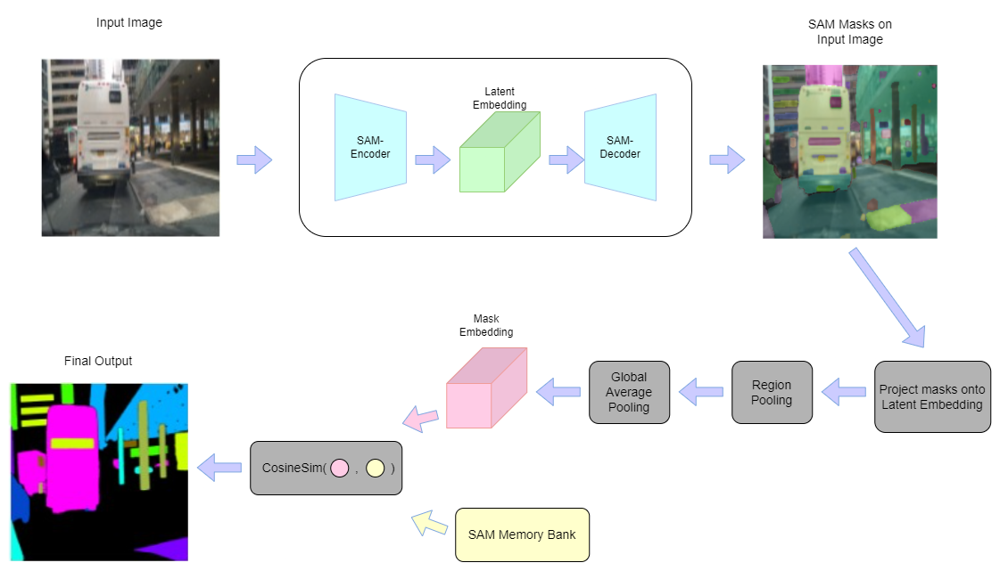
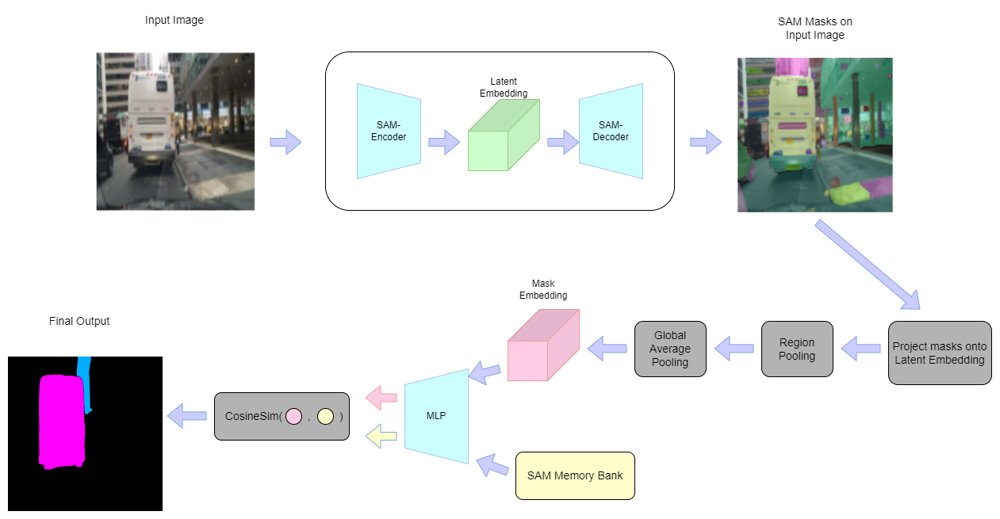
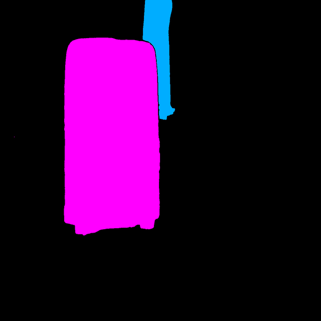

# SAM based Classification using Clustering

## Dataset
For the entire process, `BDD100k` dataset has been used.

## Motivation
[Segment Anything Paper](https://ai.meta.com/research/publications/segment-anything/) has taken the Deep Learning Community by storm when it was released. True to it's name, it has the ablity to generate segments of everything that is present in input image. 

In Segemnt Anything Paper (SAM), it was mentioned that SAM's mask embedding have semantic property and gave few examples related to it in as per ``Appendix-D6`` of the paper.

The idea is to exploit this semantic information present in the said mask embeddings and assign them to predefined classes. 

## Latent Space Probing
An analysis on latent space of SAM is done and some of the results can be seen in [latent_probing.ipynb](latent_probing.ipynb) notebook. In this analysis, we obtained `mask-embeddings` of the segements generated by SAM.
And checked for `cosine-similarity` between two embeddings.
And the results are positive. 

## Memory Bank
Since `cosine-similarity` is giving good results, to make use of this property, memory bank was introduced. `Memory bank` is nothing but a list of embedding where each class contribute a fixed number of embeddings to make it.

As SAM can take bounding box as prompts and give the segments within bounding boxes, we ran SAM through an object detection dataset and collected `mask-embeddings` for each class present in the dataset. Then these embeddings per class are subjected to KMeans Clustering thereby obtaining required number of embedding for `memory-bank` through the cluster centers that are formed.

## Classification
### Training Free

During inference, we send an image to SAM and obtain the `mask-embeddings`. Then `cosine-similarity` is calculated between `memory-bank` and `mask-embeddings` and assign the segements based on their similarity scores.

Since no training methods are involved while obtaining `memory-bank` or `mask-embeddings`, we can say this is Training Free. Code can be found in [classification.ipynb](classification.ipynb) notebook.

It is apparent that the final result is not good. It is because of following reasons.
- Semantic signal in embeddings of SAM not strong enough. Because of this, objects other than vechicles are also getting classified.
- SAM gives out an overly segemented image w.r.t the task of object segementation. Generally object segmentation is a whole body segementation whereas output of SAM is combination of whole object, part object and subpart object which leads to whole object embeddings, part object embedding(for sake of simplicity, consider part and sub-part as same). And whole object and part object embeddings are not close enough, which can be partially attributed to the first reason.

### Training an MLP

Now, if look at the inference pipeline, it is possible to convert this to supervised learning problem with a loss that combines `marginal loss` and `cosine distance`/`cosine similarity` but training any part SAM architecture is something we want to avoid.

So instead, we thought of introducing an MLP that acts as a transformation from SAM feature space to a space where memory bank embeddings, whole embeddings and part embeddings of a particular class are close, amplifying the strength of semantic signal present in the process. 

Although the result looks good, it needs further improvements. As only one vehicle is detected.  

__Code will be uploaded soon__

### Future Improvements

- Since, we ventured into learning methods, why learn not `memory-bank` itself during training? This provides a better anchors for class.
- Pruning of classes(street light and street sign).
- Change dataset from BDD100k to more generic object segmentation dataset like ImageNet. This because of following reasons.
    - Huge class imbalance. The number of cars in dataset are ~100k whereas that of trains ~100. 
    - As BDD100k is a dataset that is collected from autonomus driving perspective, all vehicles present are of back-view(of course, very few are of side-view). This may create some problems.