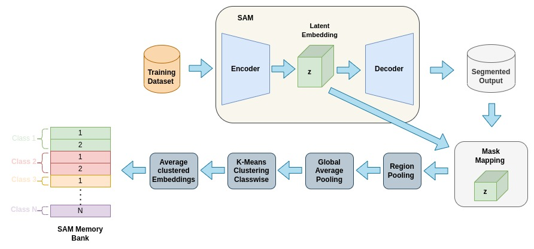

# SAM based Classification

## Motivation
[Segment Anything Paper](https://ai.meta.com/research/publications/segment-anything/) has taken the Deep Learning Community by storm when it was released. True to it's name, it has the ablity to generate segments of everything that is present in input image. 

In Segemnt Anything Paper (SAM), it was mentioned that SAM's mask embedding have semantic property and gave few examples related to it in as per ``Appendix-D6`` of the paper.

The idea is to exploit this semantic information present in the said mask embeddings and assign them to predefined classes. 

## Latent Space Probing
An analysis on latent space of SAM is done and some of the results can be seen in [latent_probing.ipynb](latent_probing.ipynb) notebook. In this analysis, we obtained `mask-embeddings` of the segements generated by SAM.
And checked for `cosine-similarity` between two embeddings.
And the results are positive. 

## Memory Bank
Since `cosine-similarity` is giving good results, to make use of this property, memory bank was introduced. `Memory bank` is nothing but a list of embedding where each class contribute a fixed number of embeddings to make it.

As SAM can take bounding box as prompts and give the segments within bounding boxes, we ran SAM through an object detection dataset and collected `mask-embeddings` for each class present in the dataset. Then these embeddings per class are subjected to KMeans Clustering thereby obtaining required number of embedding for `memory-bank` through the cluster centers that are formed.

## Classification
### Training Free

During inference, we send an image to SAM and obtain the `mask-embeddings`. Then `cosine-similarity` is calculated between `memory-bank` and `mask-embeddings` and assign the segements based on their similarity scores.

Since no training methods are involved while obtaining `memory-bank` or `mask-embeddings`, we can say this is Training Free. Code can be found in [classification.ipynb](classification.ipynb) notebook.

## Dataset
For the entire process, `BDD100k` dataset has been used.